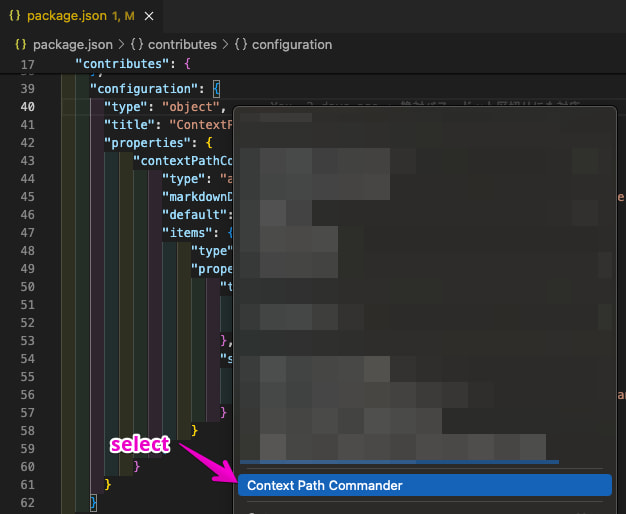
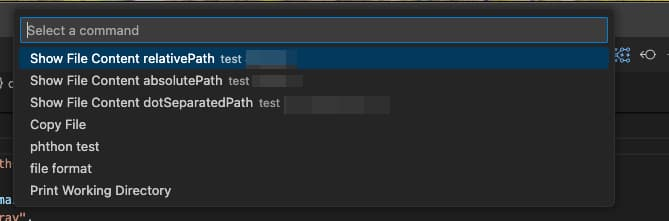

# Context Path Commander
"ContextPathCommander\" is a VSCode extension that allows users to execute specific commands based on the file path by right-clicking on files within the Explorer. Through a configuration file, users can customize the names of the commands displayed and the scripts that are executed. 

「Context Path Commander」は、VSCodeのエクスプローラー内でファイルを右クリックした際に、ファイルパスに基づいて特定のコマンドを実行することができる拡張機能です。
設定ファイルで、表示されるコマンドの名前や実行するスクリプトをカスタマイズできます。

## Usage Example

### Step 1: Configure Commands
Add your custom commands to the `settings.json` file. Refer to the "Extension Settings" section for details on how to configure the commands.

### Step 2: Right-Click on the Target File
Right-click on the target file either in the File Explorer or in the open editor, and select "Context Path Commander" from the context menu.



### Step 3: Select Command from QuickPick
A QuickPick interface will appear at the top of the screen. From this list, select the command you wish to execute.



### Step 4: Command Execution
The selected command will be executed in the terminal, with the file path placeholders (`${relativePath}`, `${absolutePath}`, `${dotSeparatedPath}`) replaced by the actual path of the file.


## Extension Settings
List of commands that users can configure to appear in the QuickPick interface when triggered from either the context menu of the Explorer or an open editor. These commands can perform specific operations based on the file path selected. 

Use `${relativePath}`/`${absolutePath}`/`${dotSeparatedPath}` as a placeholder in the script where you want the file path to be inserted.`${relativePath}` provides a file's path relative to the project's root, useful for project-specific scripts. `${absolutePath}` indicates a file's full system path, ideal for cross-directory operations. `${dotSeparatedPath}` formats paths with dots, crucial for referencing files in Python testing scripts. 

__Example:__
 ```json
 [
    {
      "title": "cat command",
      "script": "cat ${relativePath}",
      "description": "Show File Content"
    },
    {
      "title": "cp command",
      "script": "cp ${absolutePath} ./backup/",
      "description": "Copy File",  
    },
    {    
      "title": "Python test command",
      "script": "python manage.py test ${dotSeparatedPath} --keepdb --parallel ",
      "description": "Python test",
    }
  ]
  ```

